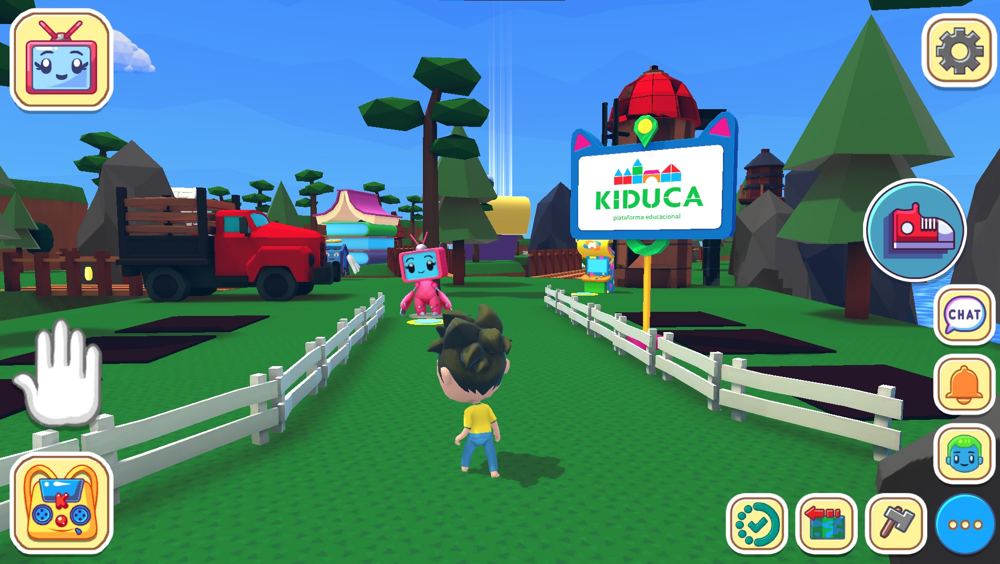
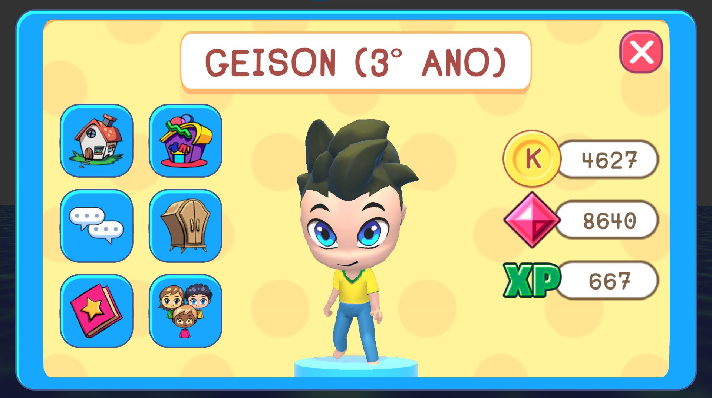
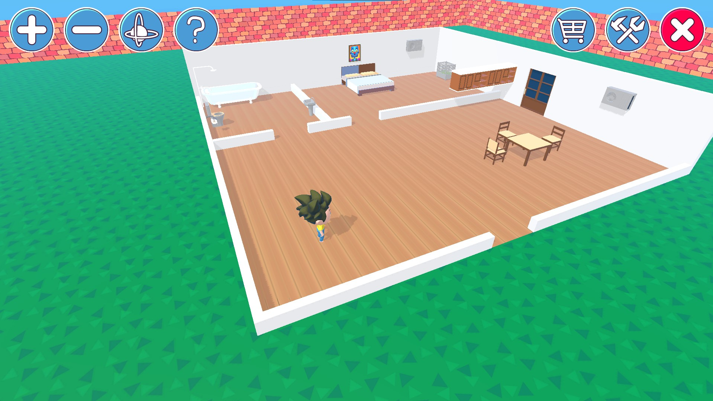
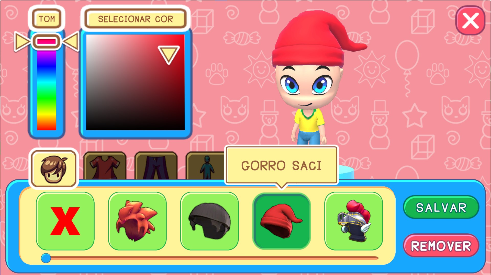
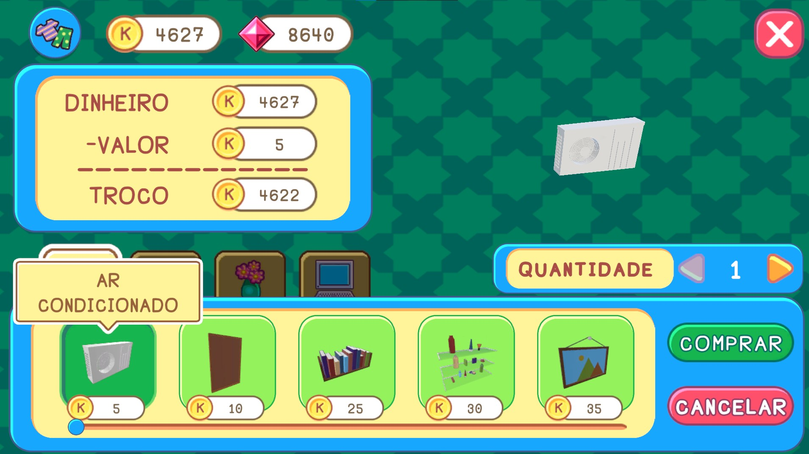
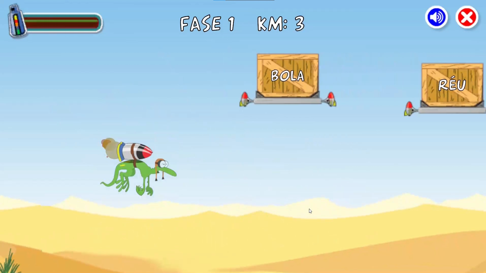
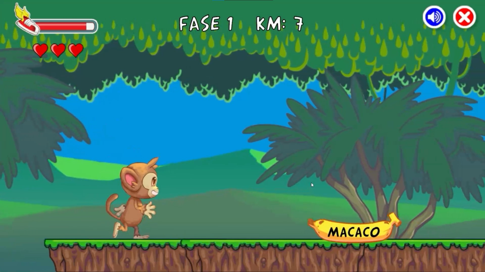
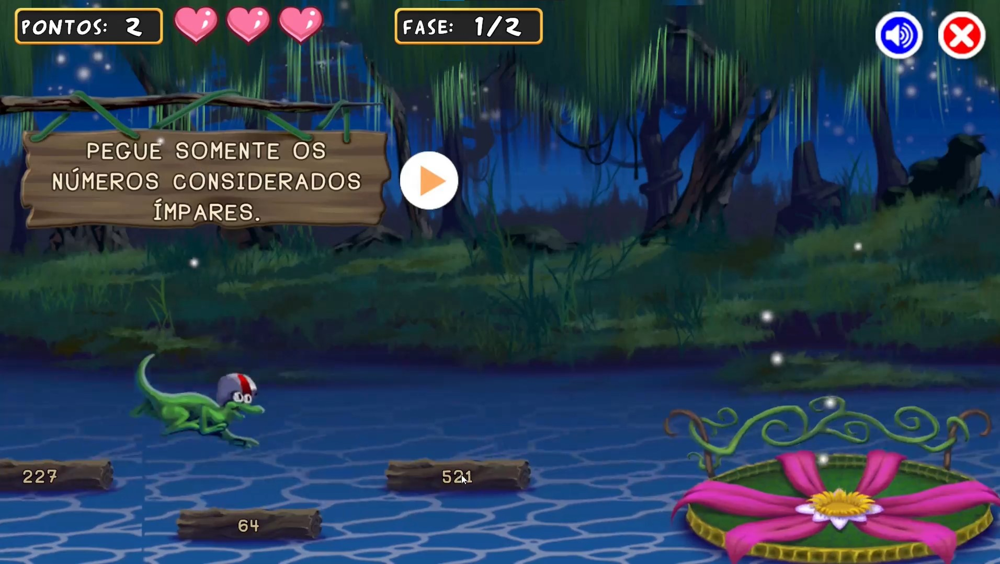

# Portfólio Kiduca

Um compilado das funcionalidades que eu participei como desenvolvedor na plataforma Kiduca (https://www.kiduca.com.br) e de alguns jogos que trabalhei na programação e funcionamento da UI. 

 Não posso colocar o código fonte e arquivos dos projetos por terem acesso privado da empresa onde trabalhei.

* O aplicativo funciona no Android, IOS e computador.
* Desenvolvido na engine Unty 3D
* Programado em C#

# Vídeo
Clique na imagem abaixo: 

# Screenshots

  
  
  
  
  
  
  
  

